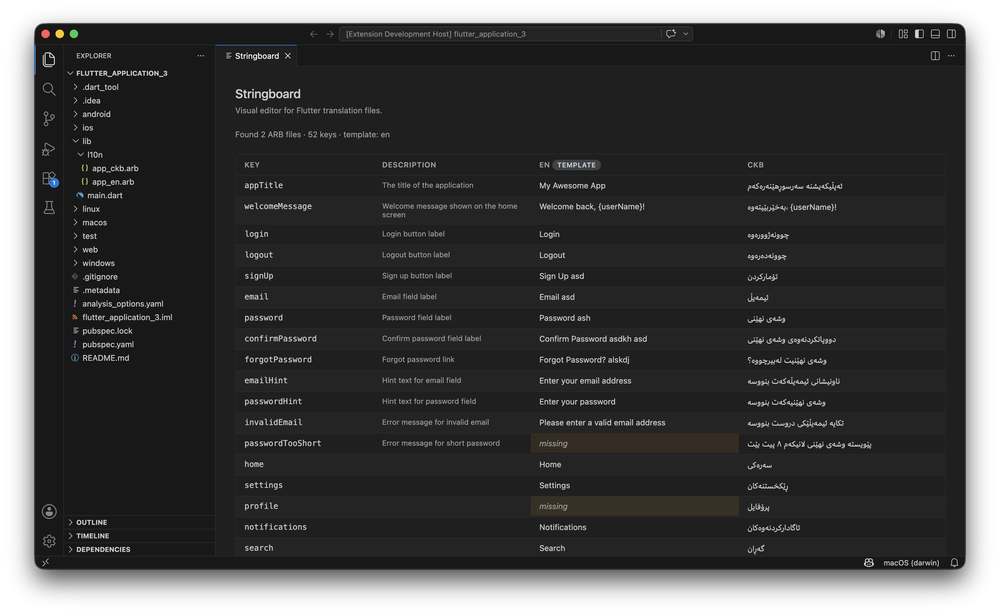

# Stringboard

**A spreadsheet for your Flutter translations — right inside VS Code.**

Stringboard brings Xcode's String Catalog experience to Flutter. Open any Flutter project, see all of your `.arb` files as a single editable grid, and fix translations inline. No new file format, no runtime dependency, no migration.



---

## Features

- **Auto-detects** your `.arb` files in `lib/l10n/` (and common alternates like `assets/i18n/`, `translations/`)
- **Unified grid view** — rows are string keys, columns are languages
- **Inline editing** — click a cell, type, tab to the next
- **Missing-translation highlighting** — empty cells get an amber tint and an italic "missing" hint
- **Theme-aware** — every color is a VS Code CSS variable, so light/dark/high-contrast all just work
- **Zero dependencies in your project** — Stringboard is an editor, not a package

## Quick start

1. Install **Stringboard** from the VS Code Marketplace.
2. Open a Flutter project that has `.arb` files (e.g. `lib/l10n/app_en.arb`, `lib/l10n/app_ar.arb`).
3. Open the command palette (`Cmd+Shift+P` / `Ctrl+Shift+P`) and run **Stringboard: Open editor**.
4. Edit cells. Changes persist automatically.

That's the whole onboarding. No configuration, no setup wizard.

## Why Stringboard

There are a handful of ARB-related extensions on the marketplace, but each of them stops short. Stringboard is the only one that combines:

| | Stringboard | `flutter_intl` | ARB Manager | Flutter ARB Editor |
|---|:-:|:-:|:-:|:-:|
| Auto-detects ARB files | ✓ | ✓ | ✗ | ✗ |
| Cross-locale grid view | ✓ | ✗ | partial | ✗ |
| Inline editing, saves to disk | ✓ | ✗ | ✓ | ✓ |
| Missing-translation highlighting | ✓ | ✗ | ✗ | ✗ |
| Theme-aware UI | ✓ | n/a | ✗ | partial |
| Zero runtime dependency in your app | ✓ | ✗ | ✓ | ✓ |

If you've ever used Xcode 15's String Catalog editor, that's the experience Stringboard is bringing to Flutter.

## Roadmap

v0.1 (this release) is intentionally focused on ARB editing. Likely candidates for v0.2 and beyond:

- EasyLocalization JSON support
- Search/filter bar
- "Add language" button to scaffold a new locale
- Right-click **Edit in Stringboard** on `.arb` files in the explorer
- CSV import/export for sending strings to translators
- Richer placeholder / plural editing
- Scan Dart files for hardcoded strings and one-click extract

Priorities will follow real user feedback. Open an issue if there's something you want.

## Contributing

Bug reports, feature requests, and PRs are all welcome at [github.com/Mhamad-Rzgar/Stringboard](https://github.com/Mhamad-Rzgar/Stringboard).

To run from source:

```bash
git clone https://github.com/Mhamad-Rzgar/Stringboard.git
cd Stringboard
npm install
# Open in VS Code, press F5 to launch the Extension Development Host
```

## License

MIT — see [LICENSE](LICENSE).
